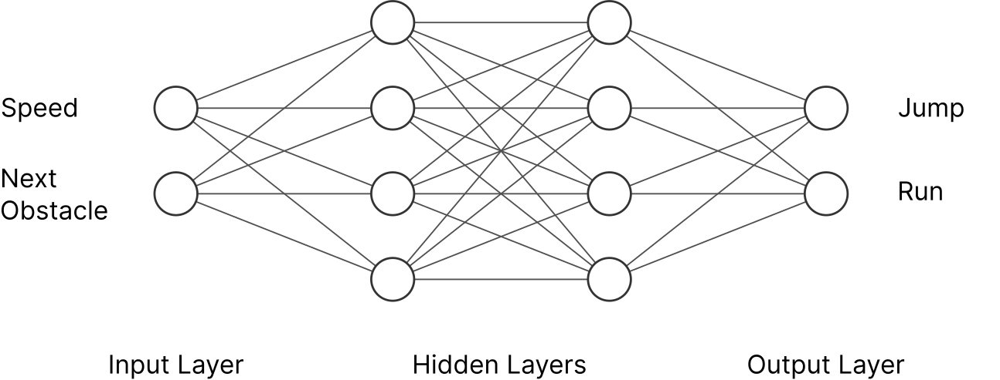

# Neuroevolutionary Chrome Dino AI

This project uses an evolutionary algorithm that evolves a neural
network so that it can play the Chrome dino game. The game is shown when a user is offline and when opening [chrome://dino](chrome://dino).

All parameters are set in [src/ai/evo.py](src/ai/evo.py). Feel free to
update them!

The pure game implementation is available at [Scr1pting/Chrome-Dino-Game](https://github.com/Scr1pting/Chrome-Dino-Game?tab=readme-ov-file).

## Neural Network

As evident in the picture, the neural network is structured as follows:

- **Input:** Game speed, distance to the next obstacle, and that
  obstacle's height.
- **Hidden Layers:** 2 hidden layers with 16 neurons each.
- **Output:** Three values for jump, duck, or run. The action with the
  highest value is performed.

## Evolution

The weights and biases of the neural network are updated by an
evolutionary algorithm. The evolutionary algorithm has the following
specifications:

- **Genome:** Each genome represents the weights and biases of the
  neural network. Initially, they have random values. There are 100
  genomes in total.
- **Fitness:** A genome is fitter if the dino collected more points.
  The points correspond to the distance the dino traveled.    
- **Selection:** the fittest 10% are included in the next generation.
  By 100 genomes in total, that corresponds to 10 selected genomes.
  Each of the selected genomes therefore forms the basis for 10 genomes
  of the next generation.
- **Elitism:** The selected genomes are included once in the next
  generation without changes. This means that a particularly fit genome
  is not lost due to a negative mutation.
- **Mutation:** With a probability of 20%, a weight or bias of a genome
  is increased or decreased by a random value in the new generation.

Crossover (that two genomes are combined) was not implemented because
it did not yield good results.

## Run

Run `python3 src/main.py` to see the dino evolve.

## Packages

The project uses [Pygame](https://www.pygame.org/docs/) for the
implementation of the game and [Numpy](https://numpy.org) for the AI.
